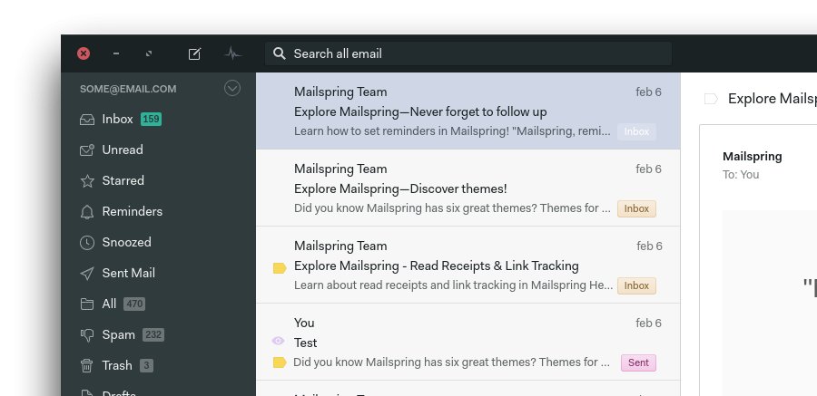

# MIGRATION NOTE

This repository soon will have different hosting (I don't really like what MS is doing with GitHub):
https://codeberg.org/jakubzet/mailspring-matcha-theme

I'll remove the GitHub repo soon ;) Cheers!

# Mailspring Matcha Theme
My adaptation of Matcha GTK theme suited for Mailspring.

The original Matcha theme is work of Vince - check his awesome piece of work in [Matcha GTK repository](https://github.com/vinceliuice/matcha). Kudos for the author for a wonderful theme and inspiration!

## FAQ

  
How can I enable aliz/azul color themes?

  
  Just edit the <strong>/styles/_colors.less</strong> file - you should enable one of the three import statements at the top of the file.

  
Can I have window controls buttons on the right-hand side?

  
There's no such option in Mailspring, however I've prepared very dirty hack which enables it! :)
Just edit the <strong>/styles/index.less</strong> file and uncomment described import statement.

  
Header looks a bit differently than other Matcha GTK3 apps title bars - can it be fixed?

  
Unfortunately Mailspring doesn't have (for now) option to make the main window transparent.
Therefore header bar cannot use border-radius. If such update appears in future, I'll update the theme.
If you are using custom window frame, please uncomment import statement in <strong>/styles/index.less</strong> to have top-border Matcha look (without border-radius though).

  
Why some components look/behave different than in other Mailspring themes?

  
I've made some tweaks, like message icons right-hand side alignment.
You're free to alter the code if you don't like the changes, but I find them rather intuitive and hope you'll like them too.

  
I've looked into the styles - and I've seen some !important statements! Are you kidding me?

  
I'll refactor the code after I'm 100% happy with the look and feel achieved. ;)

  
Do you like peanut butter?

  
I prefer Nutella.

## Todo
Currently the theme is perfectly usable. However, for the 100% effect, there are few additional tweaks to be done:
- [x] Add base Matcha colors, components style and feeling
- [x] Add different color versions
- [x] Add screenshot
- [x] Add title bar buttons
- [x] Correct minor errors (scrollbars, inputs in preferences)
- [ ] Add dark background version
- [ ] Code cleaning
